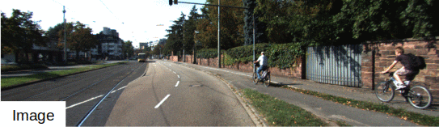

## Two-Stage Depth Completion to handle Sparse or Biased LiDAR data

> **Balanced Depth Completion between Dense Depth Inference and Sparse Range Measurements via KISS-GP**
>
> Sungho Yoon, Ayoung Kim
>
> [IROS 2020 (arXiv pdf)](https://arxiv.org/abs/2008.05158)  / [Video Link](https://www.youtube.com/watch?v=x8n0lvjvorg)

<p align="center">
  
</p>


## Abstract

Estimating a dense and accurate depth map is the key requirement for autonomous driving and robotics. Recent advances in deep learning have allowed depth estimation in full resolution from a single image. Despite this impressive result, many deep-learning-based monocular depth estimation (MDE) algorithms have failed to keep their accuracy yielding a meter-level estimation error. In many robotics applications, accurate but sparse measurements are readily available from Light Detection and Ranging (LiDAR). Although they are highly accurate, the sparsity limits full resolution depth map reconstruction. Targeting the problem of dense and accurate depth map recovery, this paper introduces the fusion of these two modalities as a depth completion (DC) problem by dividing the role of depth inference and depth regression. Utilizing the state-of-the-art MDE and our Gaussian process (GP) based depth-regression method, we propose a general solution that can flexibly work with various MDE modules by enhancing its depth with sparse range measurements. To overcome the major limitation of GP, we adopt Kernel Interpolation for Scalable Structured (KISS)-GP and mitigate the computational complexity from O(N^3) to O(N). Our experiments demonstrate that the accuracy and robustness of our method outperform state-of-the-art unsupervised methods for sparse and biased measurements.


If you find our work useful in your research please consider citing our paper:
```
@INPROCEEDINGS { syoon-2020-iros,
    AUTHOR = { Sungho Yoon and Ayoung Kim },
    TITLE = { Balanced Depth Completion between Dense Depth Inference and Sparse Range Measurements via {KISS-GP} },
    BOOKTITLE = { Proceedings of the IEEE/RSJ International Conference on Intelligent Robots and Systems (IROS) },
    YEAR = { 2020 },
    MONTH = { Oct. },
    ADDRESS = { Las Vegas },
    NOTE = { Accepted. To appear. },
}
```
